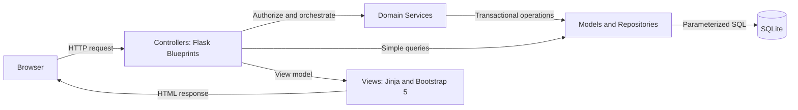

# Architecture

## Architectural style
The application uses server-rendered Flask with a strict Model-View-Controller (MVC) structure and SQLite persistence. Flask blueprints provide feature-level controller separation, Jinja provides the views, and repository-style model modules isolate SQL and data mapping.



## MVC responsibilities
### Model
- Opens request-scoped SQLite connections.
- Executes parameterized SQL and maps rows to domain data.
- Enforces persistence constraints and transactions.
- Provides repositories for users, members, trainers, sessions, bookings, and renewals.
- Exposes domain-specific errors such as `CapacityReached`, `InsufficientCredits`, and `DuplicateBooking`.

### View
- Uses Jinja template inheritance and reusable partials.
- Renders forms, tables, status badges, availability, and validation feedback.
- Uses Bootstrap 5 for responsive navigation, layout, forms, and alerts.
- Contains presentation conditions only, never SQL or authoritative business validation.

### Controller
- Defines HTTP routes in Flask blueprints.
- Reads and validates request data.
- Requires authentication and role authorization.
- Calls models/services and converts outcomes into redirects, flashes, or rendered pages.
- Uses Post/Redirect/Get for successful mutations.

## Suggested source layout
```text
main.py
fitness_studio/
  __init__.py
  config.py
  db.py
  schema.sql
  auth/
    controllers.py
  manager/
    controllers.py
  member_portal/
    controllers.py
  models/
    user.py
    member.py
    trainer.py
    workout_session.py
    booking.py
    renewal.py
  services/
    booking_service.py
    renewal_service.py
  templates/
    base.html
    auth/
    manager/
    member/
    components/
  static/
    css/app.css
tests/
```

`main.py` should only construct/run the app. `fitness_studio/__init__.py` owns `create_app()`, extension setup, error handling, and blueprint registration.

## Request lifecycle
1. Flask opens or reuses one request-scoped connection.
2. Authentication loads the current user into Flask's request context.
3. A controller verifies login and role.
4. Input is normalized and validated.
5. A model or service performs the use case.
6. A GET renders a Jinja view; a successful POST redirects.
7. Teardown closes the connection.

## SQLite strategy
- Enable `PRAGMA foreign_keys = ON` on every connection.
- Configure `PRAGMA busy_timeout` to tolerate short write contention.
- Consider WAL mode during initialization for improved read/write coexistence.
- Use explicit write transactions (`BEGIN IMMEDIATE`) for capacity-sensitive booking and credit-sensitive cancellation/renewal.
- Treat unique/check constraints as the final safeguard and map integrity errors to user-friendly domain errors.
- Keep transactions short; perform no template rendering or unrelated work inside them.

SQLite serializes writers, so strict capacity is achievable for this academic single-instance application when the capacity check and insert occur in the same immediate transaction. A future multi-instance/high-volume deployment should move to a client-server database with row-level locking.

## Security
- Hash passwords with Werkzeug; never store plaintext.
- Regenerate/clear session state on login/logout and use secure cookie settings outside development.
- Use a secret key from the environment.
- Apply CSRF protection to all forms.
- Use parameterized queries and whitelist sort/filter fields.
- Return 403 for authenticated users without permission and avoid exposing other members' identifiers/data.
- Validate dates, capacities, credit amounts, and status transitions server-side.

## Error handling and observability
- Friendly 400/403/404/409/500 pages.
- Domain conflicts such as full sessions should produce a clear message and no partial mutation.
- Structured application logs should include route/use case and record identifiers, but never passwords or sensitive session data.
- Unexpected exceptions are logged and rolled back before a generic response.
