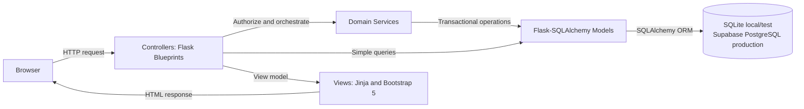

# Architecture

## Architectural style
The application uses server-rendered Flask with a Model-View-Controller (MVC)
structure. Flask blueprints provide controller separation, Flask-SQLAlchemy
models provide the persistence layer, domain services coordinate multi-model
workflows, and Jinja templates provide the views.



## MVC responsibilities
### Model
- Defines normalized Flask-SQLAlchemy entities, relationships, indexes, and
  database constraints.
- Uses the scoped SQLAlchemy session configured by the application factory.
- Provides domain state and derived properties for users, members, trainers,
  memberships, sessions, bookings, renewals, purchases, and audit events.
- Supports both SQLite and PostgreSQL without duplicating the domain model.

### View
- Uses Jinja template inheritance with a shared `base.html` and role-specific
  template folders.
- Renders forms, tables, status badges, availability, and validation feedback.
- Uses Bootstrap 5 for responsive navigation, layout, forms, and alerts.
- Contains presentation conditions only, never SQL or authoritative business validation.

### Controller
- Defines HTTP routes in Flask blueprints.
- Reads and validates request data.
- Requires authentication and role authorization.
- Calls models/services and converts outcomes into redirects, flashes, or rendered pages.
- Uses Post/Redirect/Get for successful mutations.

## Current source layout
```text
app.py                     WSGI entrypoint for local use and Vercel
fitness_studio/
  __init__.py              application factory and extension setup
  config.py                environment-aware database/integration settings
  templates/
    auth/
    manager/
    member/
    trainer/
  static/
controllers/               authentication and role-specific blueprints
models/                    Flask-SQLAlchemy entities
services/                  business transactions, read models, and integrations
skills/                    allow-listed Flask runtime AI tools
tests/
docs/
```

This is the implemented organization, not a claim that the course mandates exact
filenames. `app.py` exposes the WSGI application and delegates construction to
`fitness_studio.create_app()`. Vercel imports that same entrypoint.

## Request lifecycle
1. The WSGI entrypoint loads the application factory.
2. Authentication loads the current user into Flask's request context.
3. A controller verifies login and role.
4. Input is normalized and validated.
5. A model or service performs the use case through the SQLAlchemy session.
6. A GET renders a Jinja view; a successful POST redirects.
7. Flask-SQLAlchemy scopes and cleans up the database session.

## Persistence and transaction strategy
- Local development defaults to SQLite; tests use isolated SQLite databases.
- Production on Vercel requires a Supabase PostgreSQL `DATABASE_URL`, normally
  through the transaction pooler. Production never silently falls back to
  ephemeral Vercel SQLite.
- Flask-SQLAlchemy provides one ORM model across both dialects.
- Booking, cancellation, membership, and scheduling services keep related
  mutations in short transactions and roll back failures.
- Capacity-sensitive workflows re-read authoritative state and use
  dialect-appropriate locking: SQLite write serialization locally and row
  locking where PostgreSQL supports it.
- Unique, check, and foreign-key constraints remain final integrity safeguards.

## External integrations
- Groq supplies RAG answers and AI-assisted schedule parsing; deterministic local
  fallbacks keep demonstrations functional without a key.
- Runtime Python Skills in `skills/` are allow-listed application tools.
  Controllers remain responsible for authentication and authorization.
- Resend sends membership receipts when configured and otherwise uses a
  professional mock/logging path.
- Vercel hosts the Flask application tier while Supabase hosts production data.

## Security
- Hash passwords with Werkzeug; never store plaintext.
- Regenerate/clear session state on login/logout and use secure cookie settings outside development.
- Use a secret key from the environment.
- Apply CSRF protection to all forms.
- Use ORM-safe queries and whitelist sort/filter fields.
- Return 403 for authenticated users without permission and avoid exposing other members' identifiers/data.
- Validate dates, capacities, credit amounts, and status transitions server-side.

## Error handling and observability
- Friendly 400/403/404/409/500 pages.
- Domain conflicts such as full sessions should produce a clear message and no partial mutation.
- Structured application logs should include route/use case and record identifiers, but never passwords or sensitive session data.
- Unexpected exceptions are logged and rolled back before a generic response.
