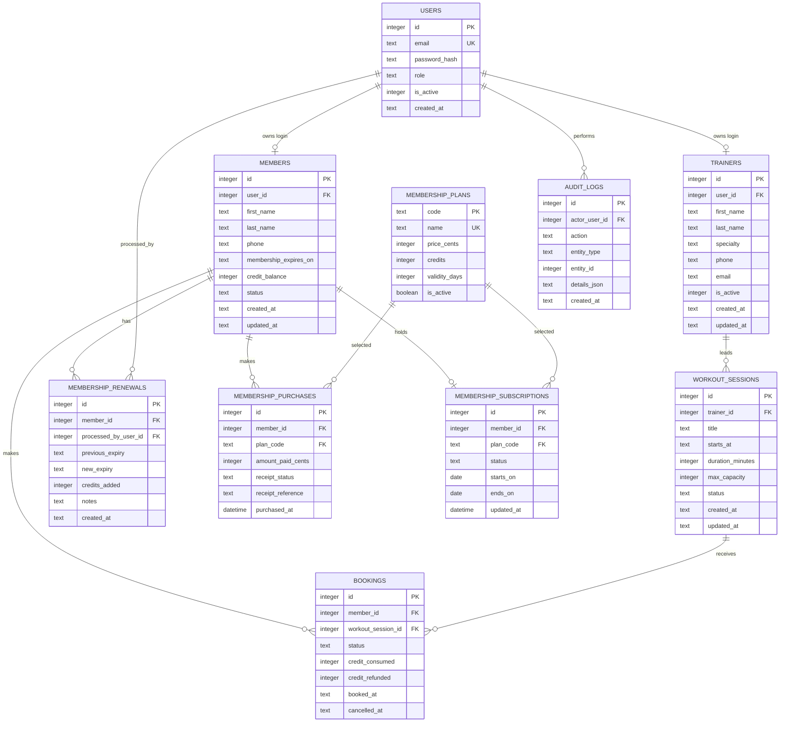

# Data Model

## Entity relationships

## Table constraints
### users
- `email` uses normalized lowercase values and is unique.
- `role IN ('manager', 'member', 'trainer')`.
- `is_active` is a boolean.

### members
- `user_id` is unique and required for member login.
- `first_name` and `last_name` are required atomic name attributes (1NF). Display `full_name` is computed in the ORM, not stored.
- `credit_balance >= 0`.
- `status IN ('active', 'inactive')`.
- Membership validity is derived from status and expiry rather than storing a second potentially inconsistent boolean.

### trainers
- `user_id` is unique and links an authenticated trainer account to at most one
  trainer profile.
- `first_name` and `last_name` are required atomic name attributes (1NF).
- `is_active` is a boolean.
- Deactivation is preferred once referenced by a session.

### membership plans, purchases, and subscriptions
- Plans are reusable definitions with non-negative price and positive credit and
  validity values.
- Purchases are append-oriented transaction records and retain receipt status
  and provider/mock reference.
- A member has at most one current subscription; its plan is referenced rather
  than duplicated.
- Subscription status is constrained to active, suspended, or cancelled.

### workout_sessions
- `duration_minutes > 0`.
- `max_capacity > 0`.
- `status IN ('scheduled', 'cancelled', 'completed')`.
- Add an index on `(status, starts_at)` and on `trainer_id`.

### bookings
- `status IN ('booked', 'cancelled')`.
- `credit_consumed IN (0, 1)`.
- `credit_refunded IN (0, 1)` and cannot be true unless the booking is cancelled and consumed a credit.
- A unique constraint on `(member_id, workout_session_id)` keeps one lifecycle
  record per member/session and prevents duplicate bookings. The current
  workflow treats that row as the authoritative booking lifecycle.
- Add indexes on `workout_session_id, status` and `member_id, status`.

### membership_renewals
- `credits_added >= 0`.
- Rows are append-only audit/history records.
- Previous and new expiry values make renewal effects explainable.

## 3NF rationale
Each table represents one subject. User credentials are separated from member business data; trainer details are not repeated on sessions; member/session details are not repeated on bookings; renewal facts are stored as history rather than repeating member attributes. Non-key attributes depend on the key, the whole key, and nothing but the key.

## Derived values
Do not persist values that can drift:
- Active booking count: count booked rows for a session.
- Remaining capacity: session capacity minus active booking count.
- Membership active: active member/account and expiry on or after the applicable current date.
- Session bookable: scheduled, future, remaining capacity positive, and member eligible.

## Transaction boundaries
- **Book:** begin a transaction, apply dialect-appropriate locking, re-read
  member/session/count, validate, insert booking, decrement credit, and commit.
- **Cancel booking:** validate the active booking and policy, cancel it, restore
  credit once, and commit atomically.
- **Purchase/renew membership:** record purchase or renewal history, update
  subscription/member expiry and credits, and commit before receipt delivery
  status is finalized.
- **Cancel session:** update status and process booking/credit effects under one
  explicit transaction.

Flask-SQLAlchemy maps this normalized model to local/test SQLite and production
Supabase PostgreSQL.
